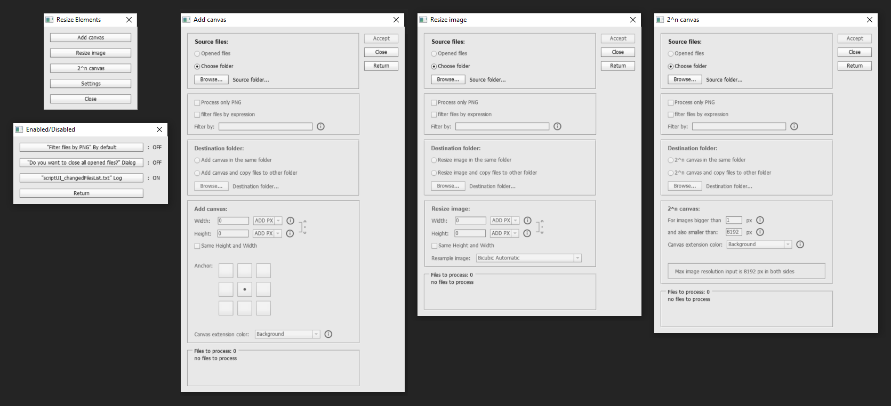
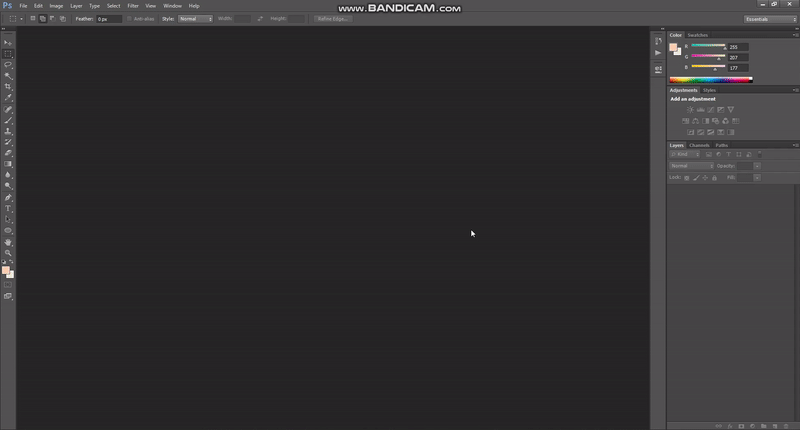
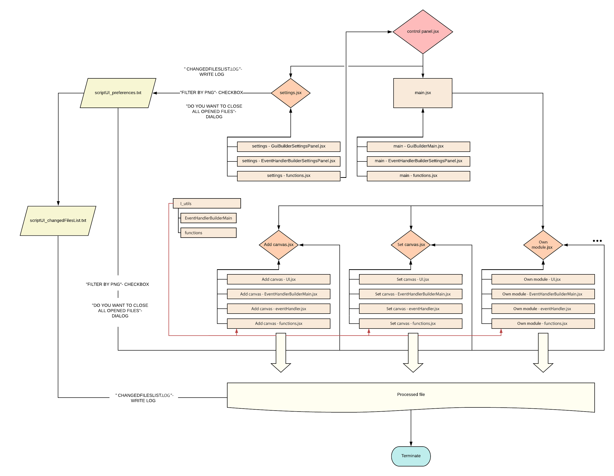

<h1 align="center">UI Photoshop toolSet </h1>

🚀🚀🚀

 This is a small plugin to automate repetitive and boring tasks connected with UI elements 

<i>
Important! Tested and created for Photshop CS6 64bit Version: 13.0 on Windows 10  
</i>

  |                Add canvas                 |                 Resize image                  |                2n canvas              |
  | :---------------------------------------: | :-------------------------------------------: |:-------------------------------------:|
  |  |  |  with input by user values

List of changed files are written in **ChangedFilesList.log**, if value in **Preferences.ini** in **"CHANGEDFILESLIST.LOG"- WRITE LOG** is **=ON**  
You can change this value by clicking button **Settings**, then button **ChangedFilesList.log" Log**

#### Toolset consist of:

- **Add canvas**

- **Resize image**

- **2^n canvas** (add a canvas for both sides by the nearest value of a power of 2)

- **Settings** (Filter source folder files by PNG, hide dialog "Do you want to close all opened files", enable writing changed names of files in "ChangedFilesList.log")

#### AppData are in: _~Documents/UI-Photoshop-toolSet_:

- **ChangedFilesList.log**

- **Preferences.ini** in which you can change values by **Settings** buttons or by rewriting them in a file:
  - "Filter files by PNG" By default
  - "Do you want to close all opened files?" Dialog
  - "ChangedFilesList.log" Writing in log

### Prerequisites 💪

To run this script you need at least **Photoshop CS6 64bit Version: 13.0** other versions of PS could not work

### Installing 🔨

1. **Download "UI-Photoshop-toolSet-master.zip"**

2. **Unzip file** in a preferred directory (suggested place is: _...\Adobe\Adobe Photoshop CS6 (64 Bit)\Presets\Scripts_)

3. **Open "Photoshop"**

4. Push keys: **Alt+F9**

5. Chose **"Action"** tabbed panel in the left upper corner

6. (If is it not yet) **Disable "Button mode"** by clicking an icon in right upper corner

7. "**Create new action**" (right bottom corner of Action window)

8. **Name script** (e. g. UI toolset), optionally assign a key to it (e. g. F12) or add color (e. g. Green)

9. Click **"ok"**

10. Choose in upper main menu: **"File -> Scripts -> Browse..."**

11. **Navigate** to unziped folder directory

12. **Open "control panel.jsx"**

13. Click **"Close"** button in UI toolset

14. Click **"Stop\playing recording"** (small grey square in the left bottom corner)

15. Enable **"Button mode"** (right upper corner)

16. Now your script is **ready to use** (Click button with your newly created action)

17. **Enjoy!**

## Running the tests 🧪

For now only manual testing is available. Use [**Adobe Phtoshop CS6 SDK Win**](http://download.macromedia.com/pub/developer/photoshop/sdk/adobe_photoshop_cs6_sdk_win.zip) to find bugs during running script

## Built With 🧰

- [**Visual Studio Code**](https://code.visualstudio.com)
- [**Adobe Phtoshop CS6 SDK Win**](http://download.macromedia.com/pub/developer/photoshop/sdk/adobe_photoshop_cs6_sdk_win.zip)
- [**ExtendScript Debugger Extension for Visual Studio Code**](https://marketplace.visualstudio.com/items?itemName=Adobe.extendscript-debug) (mainly or debugging)

## Needed documentation 📦

- [**Photoshop CS6 Scripting Guide.pdf**](https://www.adobe.com/content/dam/acom/en/devnet/photoshop/scripting/Photoshop-CS6-Scripting-Guide.pdf)
- [**JavaScript Tools Guide CS6**](https://github.com/1179432578/psd-tool/blob/master/JavaScript%20Tools%20Guide%20CS6.pdf)
- [**Photoshop CS6 JavaScript Ref.pdf**](https://www.adobe.com/content/dam/acom/en/devnet/photoshop/scripting/Photoshop-CS6-JavaScript-Ref.pdf)

## Structure of the code 🧭

## How to make own module 🪓

Just open [**How_to_make_own_module.md**](docs/How_to_make_own_module.md)

## Contributing 📬

Please read [**CONTRIBUTING.md**](docs/CONTRIBUTING.md) for details on our code of conduct, and the process for submitting pull requests to us

## Versioning 🗓️

We use [**SemVer**](http://semver.org/) for versioning in [**CHANGELOG.md**](docs/CHANGELOG.md)

## Authors 🎈

- **Karol Łukaszczyk** - _Initial work_ - [**Lukkar**](https://github.com/Lukkar90)

## License 📜

This project is licensed under the MIT License - see the [**LICENSE**](docs/LICENSE) file for details

## Acknowledgments 👍

- _README-template.md, CONTRIBUTING-template.md_ by [**PurpleBooth**](https://gist.github.com/PurpleBooth)
- [**_dateAdd()_**](https://stackoverflow.com/questions/1197928/how-to-add-30-minutes-to-a-javascript-date-object/1214753#1214753) by [**Kip**](https://stackoverflow.com/users/18511/kip)
- [**_restrictInputKeys()_**](https://stackoverflow.com/questions/59697920/is-possible-to-lock-certain-keys-in-keyboard-during-input-in-edittext-box-ph) by [**RobC**](https://stackoverflow.com/users/1611459/robc)
- persistent reviewer [**Ikulis**](https://github.com/ikulis)
