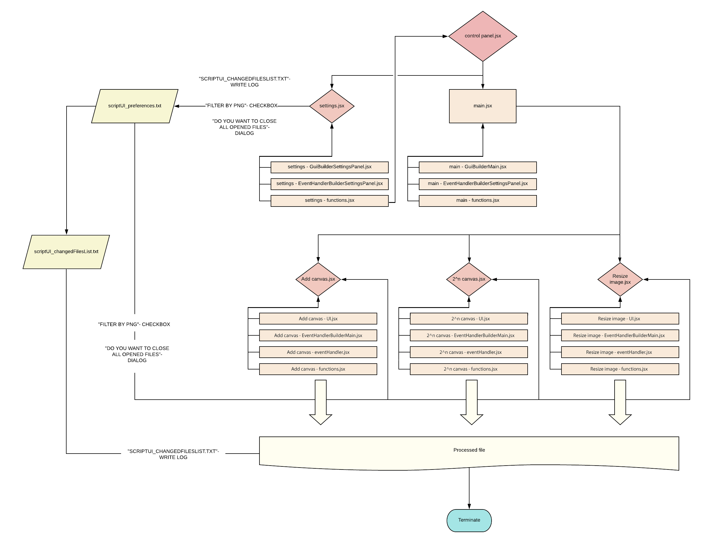

<h1 align="center">🚀 UI Photoshop toolSet 🚀 </h1>

This is small plugin to automate repetetive and boring task connected with work with UI

Tested and created for Photshop CS6 64bit Version: 13.0 on Windows 10 OS

## Getting Started

Toolset consist of:
- Add canvas.
- Resize image.
- 2^n canvas (add canvas for both sides by nearest value of power of 2).
- Settings.
- Template (not implemented).

### Prerequisites

To run this script you need at least Photshop CS6 32bit Version: 13.0.

### Installing

1. Download "UI-Photoshop-toolSet-master.zip".

2. Unzip file in preffered directory (syggested place is: ...\Adobe\Adobe Photoshop CS6 (64 Bit)\Presets\Scripts).

3. Open "Photoshop".

4. Push keys: Alt+F9.

5. Chose "Action" tabbed panel in the left upper corner.

6. (If is it not yet) Disable "Button mode" by clicking icon in right upper corner.

5. "Create new action" (right bottom corner of Action window).

6. Name script (e. g. UI toolset), optionally assign key to it (e. g. F12) or add color (e. g. Green).

7. Click "ok".

7. Choose in upper main menu: "File -> Scripts -> Browse..."

8. Navigate to unziped folder directory.

9. Open "control panel.jsx".

10. Click "Close" button in UI toolset.

11. Click "Stop\playing recording" (small grey square in the left bottom corner).

12. Enable "Button mode" (right upper corner).

13. Now your script is ready to use (Click button with your newly created action).

14. Enjoy!

## Running the tests

Click test.exe

### Break down into end to end tests

Test check if all modules work:
- Add canvas.
- Resize image.
- 2^n canvas (add canvas for both sides by nearest value of power of 2).
- Settings.

## Built With

* https://code.visualstudio.com/
* http://download.macromedia.com/pub/developer/photoshop/sdk/adobe_photoshop_cs6_sdk_win.zip
* https://marketplace.visualstudio.com/items?itemName=Adobe.extendscript-debug

## Structure of the code

## Contributing

Please read [CONTRIBUTING.md](https://github.com/Lukkar90/UI-Photoshop-toolSet/tree/master) for details on our code of conduct, and the process for submitting pull requests to us.

## Versioning

We use [SemVer](http://semver.org/) for versioning.

## Authors

* **Karol Łukaszczyk** - *Initial work* - [Lukkar](https://github.com/Lukkar90)

## License

This project is licensed under the MIT License - see the [LICENSE.md](LICENSE.md) file for details

## Acknowledgments

* README-template.md, CONTRIBUTING-template.md [ PurpleBooth](https://gist.github.com/PurpleBooth)
* dateAdd() https://stackoverflow.com/questions/1197928/how-to-add-30-minutes-to-a-javascript-date-object/1214753#1214753

